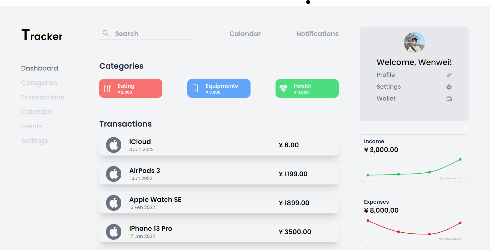

# Demo - Expense Tracker

A web project can be divided into UX Design and Development.

In this demo, I get the UI idea from Dribbble, reverse-engineer it in Figma, and finally implement it using React.JS.

Owing to time constraint, I only implement the Desktop view.

## Info

- UI inspiration: [https://dribbble.com/shots/10604883-Tracker](https://dribbble.com/shots/10604883-Tracker)

- My Figma file: [https://www.figma.com/file/QXCOFcrOlTsuJTouj9Xw02/Expense-Tracker?node-id=1303%3A1041](https://www.figma.com/file/QXCOFcrOlTsuJTouj9Xw02/Expense-Tracker?node-id=1303%3A1041)

- Live demo: [https://thankful-island-0b07d0600.1.azurestaticapps.net/](https://thankful-island-0b07d0600.1.azurestaticapps.net/)

## Preview

